<div align="center">

[](https://starsl.cn)
[](https://github.com/CassInfra/KubeDoor/commits/main)
[](https://github.com/CassInfra/KubeDoor/issues)
[](https://nodejs.org)
[](https://nodejs.org)
[](https://github.com/CassInfra/KubeDoor/blob/main/LICENSE)
[](https://www.murphysec.com/dr/Zoyt5g0huRavAtItj2)


# 花折 - KubeDoor

花开堪折直须折🌻莫待无花空折枝

### 🦄开思 开源第一弹：**基于AI推荐+专家经验的K8S负载感知调度与容量管控系统**

</div>

---
**国内用户如果访问异常，可以访问Gitee同步站：https://gitee.com/starsl/KubeDoor**


## 🏷目录
* [🌈概述](#概述)
* [💠架构图](#架构图)
* [💎功能描述](#功能描述)
* [🎯2025 KubeDoor RoadMap](#2025-kubedoor-roadmap)
* [🚀部署说明](#部署说明)
* [⛔注意事项](#注意事项)
* [🌰管控例子](#管控例子)
* [🚩管控原则](#管控原则)
* [🔔KubeDoor交流群](#KubeDoor交流群与赞赏)
* [🙇贡献者](#贡献者)
* [⭐STAR History](#STAR-History)
* [🥰鸣谢](#鸣谢)

---

## 🌈概述

🌼**花折 - KubeDoor** 是一个使用Python + Vue开发，基于K8S准入控制机制的微服务资源管控平台，以及支持多K8S集群统一远程存储、监控、告警、通知、展示的一站式K8S监控平台，并且专注微服务每日高峰时段的资源视角，实现了微服务的资源分析统计与强管控，确保微服务资源的资源申请率和真实使用率一致。
<div align="center">
   
## 💠全新架构
### 🎉花折 - KubeDoor 1.0发布！多K8S管控支持，多K8S统一监控、告警、展示最佳实践🎉

</div>

## 💎功能描述


### 💠资源监控分析：多K8S集群统一监控最佳实践
<div align="center">
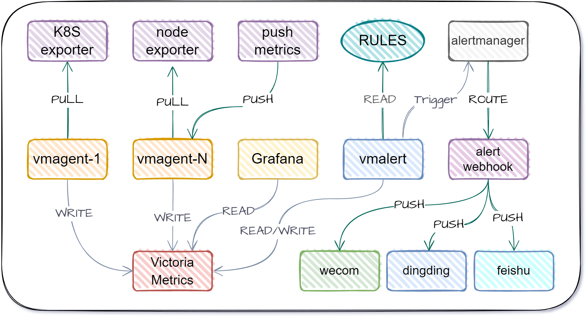
</div>

  - 🌊支持**多K8S集群**统一远程存储、监控、告警、通知、展示的一站式K8S监控方案。
  - 📀Helm一键部署完成监控、采集、展示、告警、通知（多K8S集群监控从未如此简单✨）。
  - 🚀基于VictoriaMetrics全套方案实现多K8S统一监控，统一告警规则管理，实现免配置完整指标采集。
  - 🎨WEBUI集成了K8S节点监控看板与K8S资源监控看板，均支持在单一看板中查看各个K8S集群的资源情况。
  - 📐集成了大量K8S资源，JVM资源与K8S节点的告警规则，并支持统一维护管理，支持对接企微，钉钉，飞书告警通知及灵活的@机制。
  - 🎭实时监控管理页面，对K8S资源，节点资源统一监控展示的Grafana看板。支持对微服务实时/定时/周期性的重启、扩缩容。
<div align="center">
   
| 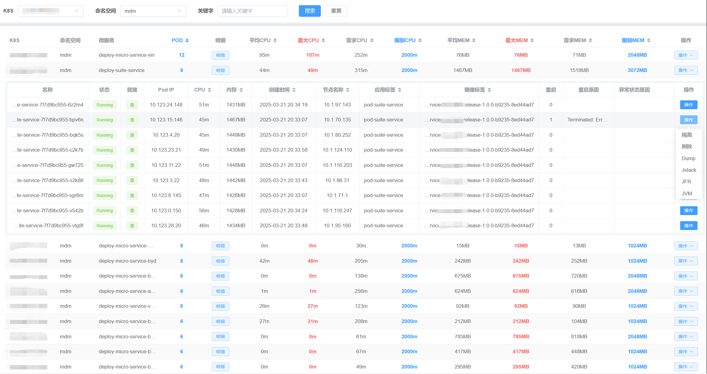 |  |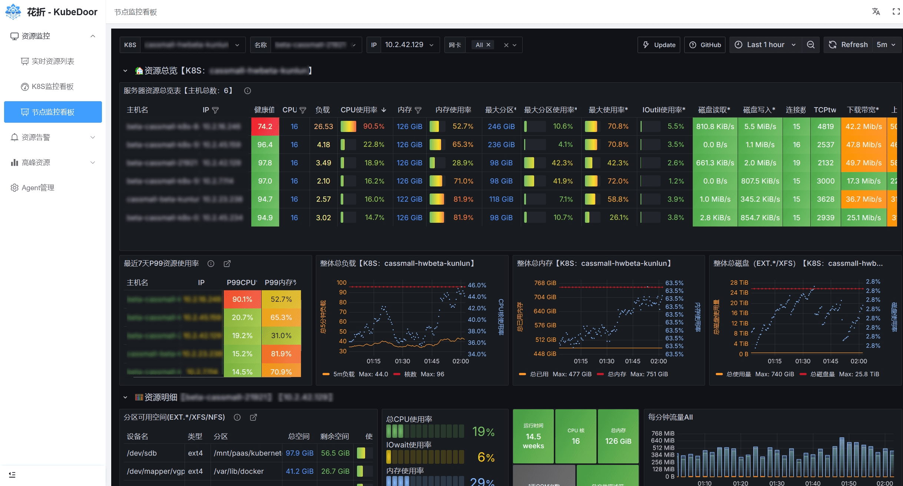 | 
| ------------------------------------| ----------------------------------- | ---------------------------------- |
| 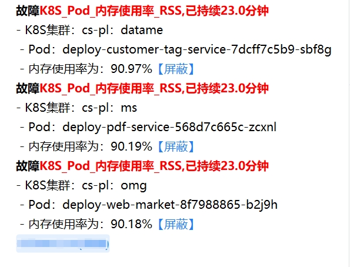 | 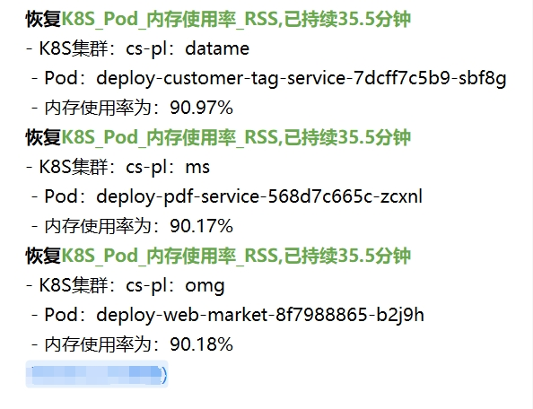 |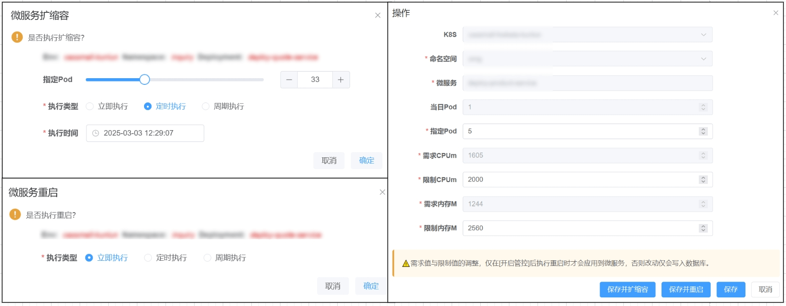| 

</div>

### 💠资源告警聚合：

- 🦄K8S微服务统一告警分析与处理页面，告警按天智能聚合，相同告警按日累计计数，每日告警清晰明了。
- 🕹️支持对POD进行隔离，删除，Java dump，jstack，jfr，JVM数据采集分析等操作，并通知到群。

<div align="center">

| 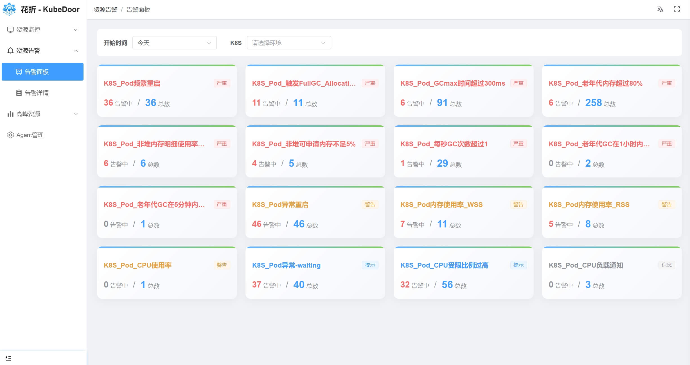 |  | 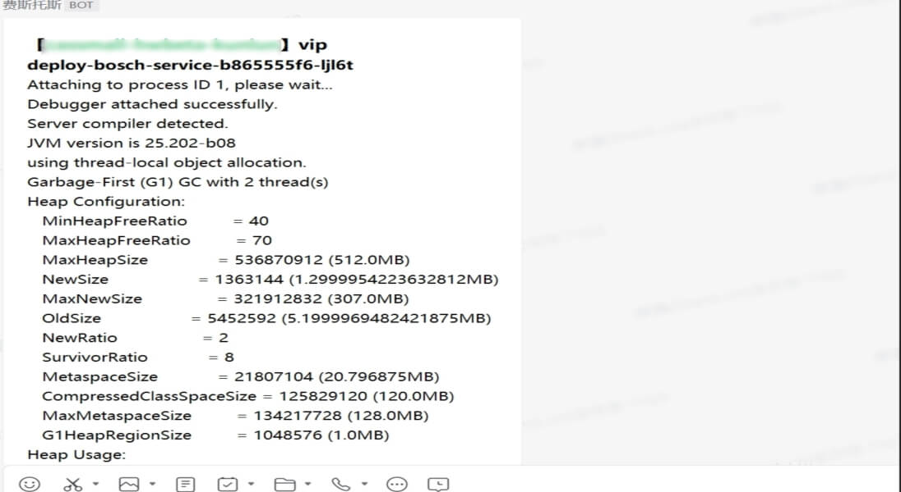 |
| ------------------------------------| ----------------------------------- | ----------------------------------- |
|  | 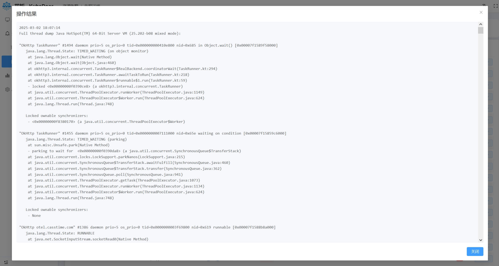 |  |
</div>


### 💠高峰期资源管控

#### 📊采集K8S微服务每日业务高峰时段P95的CPU内存消耗，以及需求、限制值与Pod数。基于采集的数据实现了一个Grafana看板并集成到了WEB UI。
  - 🎨**基于日维度采集每日高峰时段P95的资源数据**,可以很好的观察各微服务长期的资源变化情况，即使查看1年的数据也很流畅。
  - 🏅高峰时段全局资源统计与各**资源TOP10**
  - 🔎命名空间级别高峰时段P95资源使用量与**资源消耗占整体资源的比例**
  - 🧿**微服务级别**高峰期整体资源与使用率分析
  - 📈微服务与**Pod级别**的资源曲线图(需求值,限制值,使用值)
<div align="center">


</div>

#### 🎡每日从采集的数据中，获取最近10天各微服务的资源信息，获取资源消耗最大日的P95资源，作为微服务的需求值写入数据库。
  - ✨**基于准入控制机制**实现K8S微服务资源的**真实使用率和资源申请需求值保持一致**，具有非常重要的意义。
  - 🌊**K8S调度器**通过真实的资源需求值就能够更精确地将Pod调度到合适的节点上，**避免资源碎片，实现节点的资源均衡**。
  - ♻**K8S自动扩缩容**也依赖资源需求值来判断，**真实的需求值可以更精准的触发扩缩容操作**。
  - 🛡**K8S的保障服务质量**（QoS机制）与需求值结合，真实需求值的Pod会被优先保留，**保证关键服务的正常运行**。


- 💠基于日维度采集每日高峰时段P95的资源数据，提供高峰资源分析看板，📊可以很好的观察各微服务长期的资源变化情况，即使查看1年的数据也很流畅。
<div align="center">

| 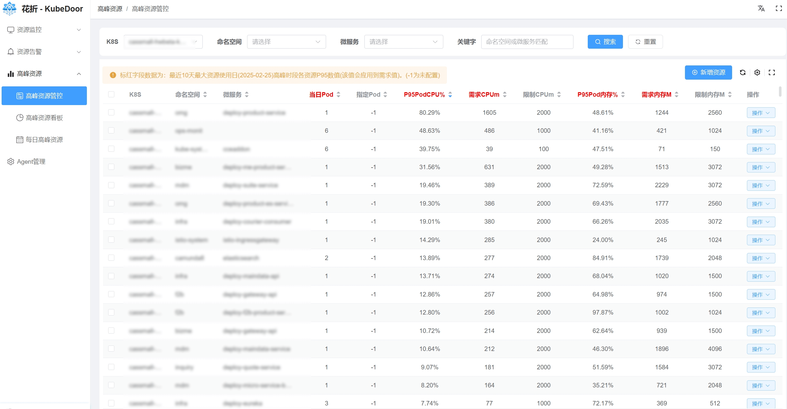  |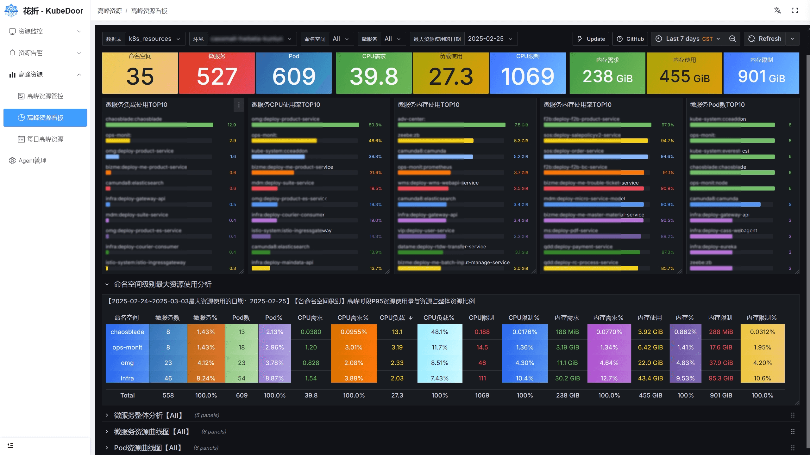 | 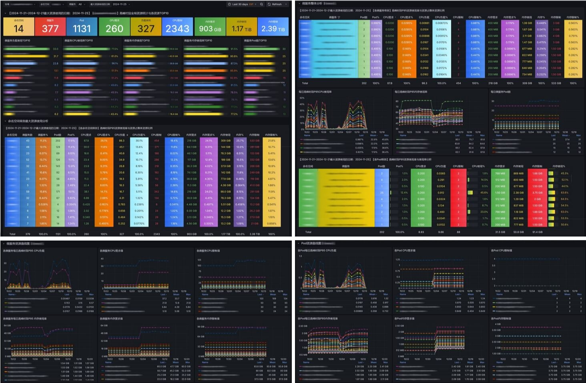 | 
| -----------------------------------| ---------------------------------- | ---------------------------------- |  
</div>


- 📀Helm一键部署完成监控、采集、展示、告警、通知（多K8S集群监控从未如此简单✨）并提供多种灵活的部署方案！

#### 因1.0架构调整，基于Mutating Webhook的针对微服务Pod数、需求值、限制值强管控的准入控制能力已临时停用。下一版本优化后重新启用。

### KubeDooe 1.0 全新架构，全新部署
```
### 【下载helm包】
wget https://StarsL.cn/kubedoor/kubedoor-1.0.0.tgz
tar -zxvf kubedoor-1.0.0.tgz
cd kubedoor
### 【master端安装】
# 编辑values-master.yaml文件，请仔细阅读注释，根据描述修改配置内容。
# try
helm install kubedoor . --namespace kubedoor --create-namespace --values values-master.yaml --dry-run --debug
# install
helm install kubedoor . --namespace kubedoor --create-namespace --values values-master.yaml
### 【agent端安装】
# 编辑values-agent.yaml文件，请仔细阅读注释，根据描述修改配置内容。
helm install kubedoor-agent . --namespace kubedoor --create-namespace --values values-agent.yaml --set tsdb.external_labels_value=kmw-prod-kunlun
```
### 访问WebUI 并初始化数据

1. 使用K8S节点IP + kubedoor-web的NodePort访问，默认账号密码都是 **`kubedoor`**

2. 点击`agent管理`，先开启自动采集，设置好高峰期时段，再执行采集，输入需要采集的历史数据时长，点击`采集并更新`，即可采集历史数据并更新高峰时段数据到管控表。
   >**默认会从Prometheus采集10天数据(建议采集1个月)，并将10天内最大资源消耗日的数据写入到管控表，如果耗时较长，请等待采集完成或缩短采集时长。重复执行`采集并更新`不会导致重复写入数据，请放心使用，每次采集后都会自动将10天内最大资源消耗日的数据写入到管控表。**

---


#### 🌐实现了一个K8S管控与展示的WEB UI。

  - ⚙️对微服务的最新、每日高峰期的**P95资源展示**，以及对**Pod数、资源限制值**的维护管理。
  - ⏱️支持**即时、定时、周期性**任务执行微服务的**扩缩容和重启**操作。 
  - 🔒基于NGINX basic**认证**，支持LDAP，支持所有**操作审计**日志与通知。
  - 📊在前端页面集成Grafana看板,更优雅的展示与分析采集的微服务数据。


#### 如果觉得项目不错，麻烦动动小手点个⭐️Star⭐️ 如果你还有其他想法或者需求，欢迎在 issue 中交流

## 🎯2025 KubeDoor RoadMap

- **[📅KubeDoor 项目进度](https://github.com/orgs/CassInfra/projects/1/views/1)**
- 🥈英文版发布
- 🏅微服务AI评分：根据资源使用情况，发现资源浪费的问题，结合AI缩容，降本增效，做AI综合评分，接入K8S异常AI分析能力。
- 🏅微服务AI缩容：基于微服务高峰期的资源信息，对接AI分析与专家经验，计算微服务Pod数是否合理，生成缩容指令与统计。
- 🏅根据K8S节点资源使用率做节点管控与调度分析
- ✅采集更多的微服务资源信息: QPS/JVM/GC
- ✅针对微服务Pod做精细化操作：隔离、删除、dump、jstack、jfr、jvm
- ✅K8S资源告警管理，按日智能聚合。
- ✅多K8S支持：在统一的WebUI对多K8S做管控和资源分析展示。
- ✅集成K8S实时监控能力，实现一键部署，整合K8S实时资源看板。
---

## 🔔KubeDoor交流群与🧧赞赏
<div align="center">
无法加群可以加微信：starsliao


</div>

## 🙇贡献者
<div align="center">
<table>
<tr>
    <td align="center">
        <a href="https://github.com/starsliao">
            
            <br />
            <sub><b>StarsL.cn</b></sub>
        </a>
    </td>
    <td align="center">
        <a href="https://github.com/xiaofennie">
            
            <br />
            <sub><b>xiaofennie</b></sub>
        </a>
    </td>
    <td align="center">
        <a href="https://github.com/shidousanxia">
            
            <br />
            <sub><b>shidousanxia</b></sub>
        </a>
    </td>
  </tr>
</table>
</div>

## ⭐STAR History

<div align="center">

[](https://github.com/CassInfra/KubeDoor)

</div>

## 🥰鸣谢

感谢如下优秀的项目，没有这些项目，不可能会有**KubeDoor**：

- 前后端技术栈
  - [Vue](https://vuejs.org/)
  - [Element Plus](https://element-plus.org)
  - [pure-admin](https://pure-admin.cn/)
  - [Flask](https://flask.palletsprojects.com)

- 基础服务
  - [VictoriaMetrics](https://victoriametrics.com/)
  - [ClickHouse](https://clickhouse.com/)
  - [Grafana](https://grafana.com/)
  - [Nginx](https://nginx.org/)

- **特别鸣谢**
  - [CassTime](https://www.casstime.com)：**KubeDoor**的诞生离不开🦄**开思**的支持。
